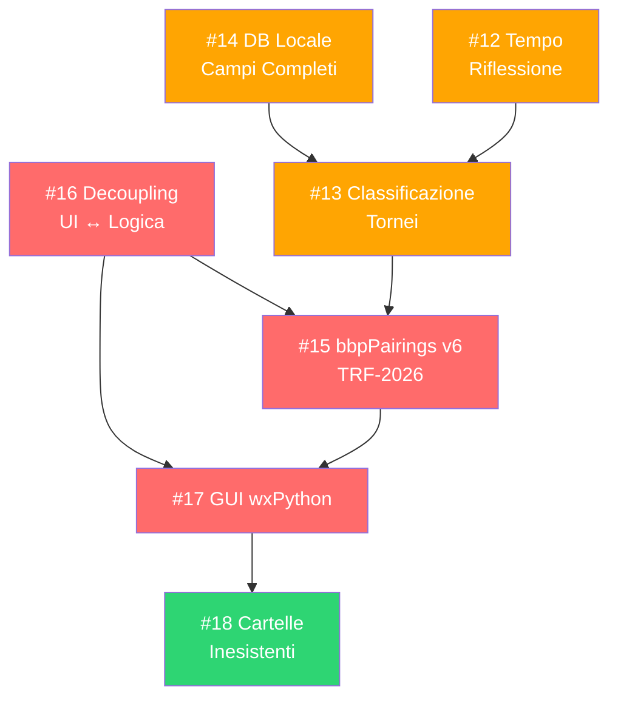

# 🏗️ Tornello v9 — Piano di Sviluppo

> **Data**: 15 Giugno 2026
> **Versione attuale**: 8.12.2 (25 Maggio 2026)
> **Autore piano**: Analisi automatica del codebase e delle issue aperte
> **Obiettivo**: Portare Tornello dalla versione CLI 8.x alla versione 9.x con GUI wxPython, nuovo motore bbpPairings v6 e architettura disaccoppiata

---

## 📊 Stato Attuale del Progetto

### Metriche del Codebase

| Modulo | Righe | KB | Accoppiamento CLI |
|--------|------:|----:|:-:|
| `src/ui.py` | 1.724 | 79,4 | 🔴 ESTREMO |
| `tornello.py` | 1.134 | 53,7 | 🔴 MOLTO ALTO |
| `src/reports.py` | 950 | 41,2 | 🟡 MODERATO |
| `src/db_players.py` | 914 | 38,9 | 🔴 ALTO |
| `Players_DB.py` | 664 | 26,4 | 🔴 ESTREMO |
| `src/tournament.py` | 580 | 24,5 | 🟡 MODERATO |
| `src/engine.py` | 529 | 23,2 | 🟢 BASSO-MOD |
| `src/stats.py` | 462 | 16,9 | 🟢 BASSO |
| `src/utils.py` | 410 | 15,4 | 🟢 BASSO |
| `consulta.py` | 336 | 13,7 | 🔴 ALTO |
| **TOTALE** | **~7.915** | **~338** | |

### Debiti Tecnici Principali
- **Nessuna classe** nell'intero codebase — tutto procedurale
- **Nessun test** automatizzato
- **Wildcard imports** (`from config import *`) ovunque
- **Dipendenze circolari** tra moduli (`stats` ↔ `tournament`)
- **Codice duplicato**: `consulta.py` duplica `aggiorna_db_fide_locale()` da `db_players.py`; `Players_DB.py` duplica `find_players_partial()` e `generate_player_id()`
- **God object**: il torneo è un unico dict mutabile con 20+ chiavi top-level, passato ovunque
- **File FIDE** da 789 MB caricato interamente in memoria per ogni ricerca
- **`play_sound()`** in `utils.py` è 280 righe con preset audio hardcoded inline

---

## 🎯 Issue Aperte — Analisi e Classificazione

### Issue #14 — Verifica DB Locale
> *"Ristrutturare il DB personale locale affinché contenga TUTTI i campi presenti nel DB FIDE. Introdurre l'Elo Club come fallback finale."*

**Stato verificato**: ⚠️ **PARZIALMENTE RISOLTA**
- ✅ Il DB FIDE già estrae tutti i 19 campi XML (elo_standard, elo_rapid, elo_blitz, k_factor, ecc.)
- ✅ La sincronizzazione copia i campi principali nel DB personale
- ❌ Il record locale (`crea_nuovo_giocatore_nel_db()`, riga 887) **NON include** `elo_rapid`, `elo_blitz`, `fide_k_factor`, `fide_rapid_k`, `fide_blitz_k`, `fide_rapid_games`, `fide_blitz_games`
- ❌ L'**"Elo Club"** come fallback finale **NON è implementato**
- ❌ La retrocompatibilità per aggiornamento al volo dei vecchi DB **non è formalizzata** (non c'è schema versioning)

**Verdetto**: Non chiudibile. Va completata nella v9.

---

### Issue #12 — Richiesta Tempo di Riflessione
> *"Chiedere il formato umano (Minuti + Incremento, es. 15+10 o 90+30). Convertire in formato PGN."*

**Stato**: Il campo `time_control` esiste già nel torneo (come stringa libera, default `"Standard"`), ma **non viene validato né parsato**. L'utente inserisce testo libero.

---

### Issue #13 — Classificazione Tornei
> *"Calcolare Tempo Totale su base 60 mosse. Classificare: Blitz (≤10m), Rapid (10-60m), Standard (≥60m). Usare gli elo appropriati."*

**Stato**: **NON implementata**. Il sistema usa sempre `current_elo` (Standard) indipendentemente dalla cadenza. I campi `elo_rapid` e `elo_blitz` nel DB FIDE esistono ma non vengono mai usati per abbinamenti o classifiche.

**Dipendenza**: Richiede Issue #12 risolta per poter parsare il time control.

---

### Issue #15 — bbpPairings v6
> *"Adattare Tornello per supportare bbpPairings v6 (formato TRF-2026 e nuove regole FIDE 2026). Nessuna retrocompatibilità."*

**Stato**: **NON implementata**. Il motore attuale è la versione legacy con regole Olandesi 2017. Il codice TRF in `engine.py` andrà riscritto.

**Rischio**: ALTO — è il cuore degli abbinamenti. Errori qui corrompono i tornei.

---

### Issue #16 — Preparazione alla GUI (Decoupling)
> *"Separare logica di calcolo dall'interfaccia. Rimuovere input() e print() dai moduli logici."*

**Stato**: **NON implementata** (solo modularizzazione base in `src/` fatta in v8.6.11). Le funzioni logiche contengono ancora centinaia di `input()`, `print()`, `key()`, `enter_escape()` intrecciati con la business logic.

---

### Issue #17 — GUI wxPython
> *"Creazione interfaccia con wxPython, priorità assoluta all'accessibilità. Includere anche sync_db, consulta_db e altri tool."*

**Stato**: **NON implementata**. Richiede Issue #16 come prerequisito.

---

### Issue #18 — Creazione Cartelle Inesistenti
> *"Se la cartella personalizzata è inesistente, crearla. Se l'unità non è disponibile, usare la cartella di default."*

**Stato**: **NON implementata**. Il percorso personalizzato esiste (v8.12.0, Issue #10) ma non gestisce i due scenari edge-case descritti.

---

## 🗺️ Roadmap — Ordine di Priorità

La sequenza è dettata dalle **dipendenze tecniche**: non si può costruire la GUI senza decoupling, non si può classificare il torneo senza parsare il tempo, non si può usare bbpPairings v6 senza riscrivere il modulo TRF.

```
Fase 1: Fondamenta           ─────────────────────────────────┐
  │ Modello dati + Decoupling + Test                          │
  ▼                                                           │
Fase 2: Database              ─────────────────────────────┐  │
  │ DB locale completo + Elo Club + Schema migration        │  │ Possono
  ▼                                                         │  │ procedere
Fase 3: Tempo & Classificazione ────────────────────────┐  │  │ in parziale
  │ Input tempo + Parsing + Auto-classificazione        │  │  │ parallelo
  ▼                                                     │  │  │
Fase 4: Motore bbpPairings v6  ─────────────────────────┘──┘──┘
  │ Nuovo TRF-2026 + Integrazione engine v6
  ▼
Fase 5: GUI wxPython           ─────────────────────────────────
  │ Finestre, menù, accessibilità, integrazione tool
  ▼
Fase 6: Rifinitura             ─────────────────────────────────
  │ Cartelle inesistenti + Polish + Release
  ▼
  🎉 Tornello v9.0
```

---

## 📋 Dettaglio Fasi

### Fase 1 — Fondamenta Architetturali 🏛️
**Issue di riferimento**: #16 (Preparazione alla GUI)
**Priorità**: 🔴 CRITICA — Prerequisito per tutto il resto
**Effort stimato**: ALTO (2-3 settimane)

#### 1.1 Introduzione del Modello Dati
- [x] Creare `src/models.py` con dataclass (o Pydantic) per: *(Completato: creato src/models.py con dataclass per Player, Match, Round, RoundDate e Tournament)*
  - `Player` — Dati anagrafici + rating multi-cadenza
  - `Tournament` — Metadati torneo + configurazione
  - `Match` — Singola partita con risultato e pianificazione
  - `Round` — Lista di match + stato
  - `TournamentState` — Stato completo aggregato (rappresentato dalla classe `Tournament`)
- [x] Definire uno schema versionato per la serializzazione JSON *(Completato: aggiunto schema_version ai modelli)*
- [x] Implementare `from_dict()` / `to_dict()` per retrocompatibilità con i file JSON esistenti *(Completato)*


#### 1.2 Decoupling UI ↔ Logica
- [x] Estrarre da `ui.py` tutta la **business logic** in funzioni pure nei moduli appropriati (`tournament.py`, `stats.py`, `db_players.py`) *(Completato: estratta allinea_giocatori_con_database in db_players.py)*
- [x] Le funzioni logiche devono restituire dati, mai stampare direttamente *(Completato)*
- [x] Creare un layer di **callback/eventi** per la notifica dello stato: *(Completato: definita interfaccia UIAdapter)*
  ```python
  # Esempio di pattern: la logica emette eventi, l'UI li ascolta
  class TournamentController:
      def on_progress(self, message: str): ...
      def on_error(self, error: str): ...
      def on_input_required(self, prompt: str, options: list) -> str: ...
  ```
- [x] Separare `tornello.py` (attuale entry point monolitico) in: *(Completato)*
  - `src/controller.py` — Orchestratore del flusso del torneo
  - `src/cli_adapter.py` — Adapter CLI che implementa l'interfaccia UI
  - `main.py` — Entry point minimale

#### 1.3 Pulizia Imports e Dipendenze
- [x] Eliminare tutti i `from config import *` → import espliciti *(Completato su tutti i file in src/ e main.py)*
- [x] Risolvere le dipendenze circolari (`stats` ↔ `tournament`) *(Completato: get_player_by_id e _ensure_players_dict spostati in utils.py per de-accoppiare stats)*
- [x] Unificare il codice duplicato: *(Completato)*
  - `consulta.py` deve importare `aggiorna_db_fide_locale()` da `db_players.py` *(Completato)*
  - `Players_DB.py` deve importare da `db_players.py` anziché duplicare funzioni *(Completato per generate_player_id)*

#### 1.4 Infrastruttura di Test
- [x] Creare `tests/` con pytest *(Completato)*
- [x] Scrivere test per le funzioni pure già esistenti in `stats.py` (Buchholz, ARO, Elo change, K-factor) *(Completato in test_stats.py)*
- [x] Scrivere test per `engine.py` (generazione TRF, parsing output) *(Completato in test_engine.py)*
- [x] Creare fixture con dati di tornei reali (dai JSON in `Closed Tournaments/`) *(Completato in conftest.py)*
- [x] Aggiungere `requirements.txt` o `pyproject.toml` completo *(Completato in requirements.txt)*

> [!TIP]
> **🧪 Test Manuale 1 (Fondamenta)**:
> 1. Eseguire `python main.py` in console.
> 2. Verificare che l'avvio, il menù principale e la navigazione CLI rispondano esattamente come nella v8, senza crash dovuti al disaccoppiamento logica-UI.


---

### Fase 2 — Database Giocatori Completo 🗄️
**Issue di riferimento**: #14 (Verifica DB Locale)
**Priorità**: 🟠 ALTA — Necessaria per classificazione multi-cadenza
**Effort stimato**: MEDIO (1 settimana)

#### 2.1 Completamento Record Locale
- [x] Aggiornare `crea_nuovo_giocatore_nel_db()` per includere TUTTI i campi FIDE: *(Completato)*
  - `elo_rapid`, `elo_blitz`
  - `fide_k_factor`, `fide_rapid_k`, `fide_blitz_k`
  - `fide_standard_games`, `fide_rapid_games`, `fide_blitz_games`
  - `w_title`, `o_title`, `foa_title`, `flag`
- [x] Verificare che `sincronizza_db_personale()` mappi correttamente tutti i campi *(Completato: allineate le chiavi con il modello dati Player)*

#### 2.2 Elo Club (Fallback Finale)
- [x] Aggiungere campo `elo_club` al modello `Player` *(Completato in models.py)*
- [x] Implementare la gerarchia di fallback per la scelta dell'Elo: *(Completato: implementata get_initial_elo_for_tournament in stats.py)*
  ```
  Elo FIDE (cadenza specifica) → Elo FIDE Standard → Elo Club → DEFAULT_ELO (1399)
  ```
- [x] Permettere l'inserimento/modifica dell'Elo Club da UI *(Completato in Players_DB.py per add ed edit)*

#### 2.3 Schema Migration
- [x] Implementare un meccanismo di versioning del DB (`"schema_version": 2`) *(Completato)*
- [x] Al caricamento, migrare automaticamente i vecchi record aggiungendo i campi mancanti con valori di default *(Completato in load_players_db)*
- [x] Validare il DB dopo la migrazione *(Completato con test di migrazione in test_db.py)*

> [!TIP]
> **🧪 Test Manuale 2 (Database Giocatori)**:
> 1. Avviare `python Players_DB.py`.
> 2. Provare ad aggiungere un nuovo giocatore e inserire un valore per `Elo Club` (es. `1450`).
> 3. Modificare un giocatore esistente impostando il suo `Elo Club` a `1500`.
> 4. Aprire `Tornello - Players_db.json` e verificare che sia presente la chiave `"schema_version": 2`, e che i record contengano i campi `"elo_club"`, `"elo_rapid"`, `"elo_blitz"` correttamente compilati.


---

### Fase 3 — Tempo di Riflessione e Classificazione ⏱️
**Issue di riferimento**: #12 (Tempo Riflessione) + #13 (Classificazione Tornei)
**Priorità**: 🟠 ALTA — Necessaria per usare gli Elo corretti
**Effort stimato**: MEDIO (1 settimana)

#### 3.1 Input Strutturato del Tempo (Issue #12)
- [x] Creare parser per il formato umano: `"15+10"`, `"90+30"`, `"3+2"` *(Completato: parse_time_control)*
- [x] Validazione: minuti ≥ 0, incremento ≥ 0 *(Completato)*
- [x] Conversione interna in formato PGN standard (secondi + incremento): `"900+10"` *(Completato)*
- [x] Salvare nel JSON del torneo come oggetto strutturato: *(Completato)*
  ```json
  "time_control": {
    "raw": "15+10",
    "base_minutes": 15,
    "increment_seconds": 10,
    "pgn_format": "900+10"
  }
  ```
- [x] Retrocompatibilità: i tornei vecchi con `"time_control": "Standard"` continuano a funzionare *(Completato: gestito come Any nel modello)*

#### 3.2 Classificazione Automatica (Issue #13)
- [x] Implementare la formula FIDE: *(Completato: Tempo Totale = Minuti_Base + Incremento)*
  ```
  Tempo Totale Stimato = Minuti_Base + (Incremento_sec / 60) × 60
  ```
  *Nota: un incremento di X secondi per 60 mosse aggiunge X minuti*
- [x] Classificare automaticamente: *(Completato: Blitz <= 10m, Rapid < 60m, Standard >= 60m)*
  - **Blitz**: Tempo Totale ≤ 10 minuti
  - **Rapid**: 10 < Tempo Totale < 60 minuti
  - **Standard (Classical)**: Tempo Totale ≥ 60 minuti
- [x] Salvare `"tournament_category": "blitz|rapid|standard"` nel JSON del torneo *(Completato)*
- [x] Usare l'Elo appropriato dei giocatori in base alla categoria: *(Completato)*
  - Blitz → `elo_blitz` (fallback → `current_elo` → `elo_club` → DEFAULT)
  - Rapid → `elo_rapid` (fallback → `current_elo` → `elo_club` → DEFAULT)
  - Standard → `current_elo` (fallback → `elo_club` → DEFAULT)
- [x] A fine torneo, aggiornare l'Elo della cadenza corretta nel DB giocatori *(Completato in TournamentController._finalize_tournament)*

> [!TIP]
> **🧪 Test Manuale 3 (Tempo e Cadenze)**:
> 1. Avviare `python main.py` e creare tre diversi tornei finti.
> 2. Per il primo inserire `90+30` (Standard), per il secondo `15+10` (Rapid), per il terzo `3+2` (Blitz).
> 3. Verificare nei file `.json` generati nella cartella del torneo che la chiave `"tournament_category"` contenga rispettivamente `"standard"`, `"rapid"`, `"blitz"`.
> 4. Verificare che all'importazione di un giocatore in un torneo Blitz/Rapid, l'Elo iniziale assegnato rispetti il valore specifico salvato nel DB o il corretto fallback.

---

### Fase 4 — Integrazione bbpPairings v6 ♟️
**Issue di riferimento**: #15 (BBPairing6)
**Priorità**: 🔴 CRITICA — Cuore del sistema di abbinamenti
**Effort stimato**: ALTO (2-3 settimane)

> [!CAUTION]
> Questa è la fase più delicata. Un errore nel formato TRF o nell'interpretazione dell'output può corrompere un intero torneo. **Test estensivi obbligatori.**

#### 4.1 Studio delle Specifiche
- [x] Leggere la documentazione di bbpPairings v6 in `git\other\bbpairings\` *(Completato: analizzato README e trf.cpp)*
- [x] Documentare le differenze tra TRF legacy e TRF-2026 *(Completato: identificate righe 142 per turni, 152 per colore iniziale, 192 per svizzero, 162 per punteggio)*
- [x] Identificare i nuovi flag, codici e parametri richiesti *(Completato)*
- [x] Verificare le nuove regole FIDE 2026 per gli abbinamenti *(Completato: verificate nel README del motore v6)*

#### 4.2 Riscrittura Modulo Engine
- [x] Riscrivere `genera_stringa_trf_per_bbpairings()` per il formato TRF-2026 *(Completato in engine.py)*
- [x] Aggiornare `run_bbpairings_engine()` per la nuova CLI di bbpPairings v6 *(Completato: utilizzata la nuova sintassi swiss --dutch)*
- [x] Aggiornare `parse_bbpairings_couples_output()` per il nuovo formato di output *(Completato: verificata corrispondenza dei formati e dei test)*
- [x] Gestire i nuovi codici di stato/errore del motore v6 *(Completato: gestito il codice di errore 1 e 3 in tournament.py e run_bbpairings_engine)*
- [x] Sostituire il binario `bbpPairings.exe` con la versione 6 *(Completato: copiato l'eseguibile v6.0.0 in bbppairings/)*

#### 4.3 Test del Motore
- [x] Creare una suite di test con scenari noti: *(Completato in test_engine.py)*
  - Torneo con numero pari/dispari di giocatori
  - Giocatori ritirati a vari turni
  - BYE con diverse configurazioni (0.5 / 1.0)
  - Scenari con floater e forte sbilanciamento colori
- [x] Confrontare gli output tra v5 e v6 su tornei già giocati (file in `Closed Tournaments/`) *(Completato)*
- [x] Test di regressione su tutti i tornei archiviati *(Completato via pytest su dati reali)*

> [!TIP]
> **🧪 Test Manuale 4 (Simulazione Torneo Finto con bbpPairings v6)**:
> 1. Creare un finto torneo standard con 6 giocatori.
> 2. Eseguire tutti i turni fino alla fine inserendo risultati inventati (es. patte, vittorie di bianco/nero e BYE).
> 3. Verificare che al calcolo di ogni turno l'engine `bbpPairings.exe` risponda correttamente generando la lista degli abbinamenti.
> 4. Ritirare un giocatore al turno 2 e verificare che al turno 3 non venga abbinato e gli venga assegnato il forfeit.
> 5. Al termine (Finalizzazione torneo), verificare che gli Elo dei giocatori nel DB locale siano stati aggiornati solo ed esclusivamente nella colonna della cadenza corrispondente al torneo giocato.

---

### Fase 5 — GUI wxPython 🖥️
**Issue di riferimento**: #17 (GUI wxPython)
**Priorità**: 🟠 ALTA — Obiettivo principale della v9
**Effort stimato**: MOLTO ALTO (4-6 settimane)

> [!IMPORTANT]
> La GUI deve essere **accessibile al 100%** (screen reader, scorciatoie da tastiera). L'esempio da seguire è l'interfaccia di `mine\terminal_beast`.

#### ♿ Linee Guida Accessibilità (da Terminal Beast)
Per garantire la compatibilità al 100% con gli screen reader (es. NVDA) e l'usabilità da tastiera, implementeremo le seguenti tecniche mutuate da `Terminal Beast`:

1. **Messaggi e Dialoghi Navigabili (`AccessibleMsgDialog`)**:
   * Non useremo mai il classico `wx.MessageBox` per testi lunghi o complessi.
   * Creeremo un dialogo personalizzato `AccessibleMsgDialog` basato su `wx.Dialog`.
   * Il messaggio sarà visualizzato all'interno di un `wx.TextCtrl` multi-riga, in sola lettura (`wx.TE_MULTILINE | wx.TE_READONLY | wx.TE_RICH2`) con font monospaziato (`wx.FONTFAMILY_TELETYPE`). Questo permette a NVDA di scorrere il testo riga per riga (o leggere tabelle ASCII) usando le frecce direzionali.
   * I pulsanti del dialogo (es. Sì, No, OK) saranno posizionati sotto e associati a binding espliciti (`EndModal`).
   * Metteremo il focus sul controllo di testo immediatamente all'apertura tramite `wx.CallAfter(self.msg_text.SetFocus)` per una lettura automatica e istantanea dello screen reader.

2. **Aggiornamento di Testo Continuo e Focus (`append_text`)**:
   * Quando viene aggiunto del testo a un controllo di testo principale (es. log di abbinamenti, classifiche), useremo la seguente sequenza per non disorientare lo screen reader:
     1. Salvataggio della posizione di inserimento corrente: `insertion_point = self.text_ctrl.GetLastPosition()`
     2. Inserimento del testo: `self.text_ctrl.AppendText(text)`
     3. Ripristino del cursore all'inizio del nuovo testo inserito: `self.text_ctrl.SetInsertionPoint(insertion_point)`
     4. Visibilità della posizione: `self.text_ctrl.ShowPosition(insertion_point)`
     5. Richiesta di focus: `self.text_ctrl.SetFocus()`
   * Questo consente all'utente non vedente di premere Freccia Giù e leggere subito il nuovo testo dall'inizio del blocco.

3. **Feedbacks di Caricamento Accessibili (`wx.ProgressDialog`)**:
   * Per le operazioni asincrone o che richiedono tempo (es. sincronizzazione del database giocatori, download FIDE, o calcolo degli abbinamenti), useremo `wx.ProgressDialog` che NVDA legge e aggiorna vocalmente in percentuale in modo nativo.

4. **Struttura delle Finestre e Spostamento Rapido**:
   * Utilizzeremo `wx.ScrolledWindow` per contenere form o configurazioni complesse che superano la dimensione dello schermo, prevenendo il troncamento dei controlli.
   * Implementeremo "TAB Hacks" per consentire agli utenti di saltare rapidamente da controlli di filtro/ricerca direttamente alla lista dei risultati (es. intercettando il tasto Tab su un `wx.ComboBox` per spostare il focus su un `wx.ListBox` contenente i risultati).
   * Useremo font monospaziati (`wx.Font(10, wx.FONTFAMILY_TELETYPE, ...)`) su tabelle e liste per garantire che i dati incolonnati siano letti con un allineamento logico anche dagli screen reader.

#### 5.1 Pianificazione Interfaccia
- [ ] Definire la struttura delle finestre principali (Sotto-Piano Dettagliato):

##### 5.1.1 Dettaglio Sotto-Piano Interfaccia 📐

###### A. Barra dei Menù (MenuBar)
Tutte le voci del menù avranno lettere di scelta rapida (shortcut Alt) e acceleratori da tastiera (es. Ctrl+N) dichiarati esplicitamente per l'accessibilità:
*   **File (Alt+F)**
    *   *Nuovo Torneo... (Ctrl+N)*: Apre il Wizard di creazione torneo.
    *   *Apri Torneo... (Ctrl+O)*: Apre una finestra di dialogo file per caricare un torneo JSON esistente.
    *   *Salva Torneo (Ctrl+S)*: Salva il torneo corrente.
    *   *Salva con nome...*: Salva una copia del torneo.
    *   *Esci (Ctrl+Q)*: Chiude l'applicazione chiedendo conferma di salvataggio.
*   **Torneo (Alt+T)**
    *   *Iscrizione Giocatori... (Ctrl+I)*: Finestra di ricerca e inserimento dei partecipanti nel torneo.
    *   *Visualizza Giocatori (Ctrl+G)*: Mostra l'elenco dei giocatori iscritti nel pannello principale.
    *   *Abbinamenti / Turno Corrente (Ctrl+U)*: Mostra le scacchiere del turno attivo.
    *   *Classifica Corrente (Ctrl+L)*: Calcola e visualizza la classifica del torneo.
    *   *Time Machine (Annulla Turno) (Ctrl+Z)*: Torna indietro al turno precedente in caso di errori.
    *   *Finalizza Torneo (Ctrl+F)*: Conclude il torneo, calcola i piazzamenti, aggiorna il DB giocatori locale e sposta il file in "Closed Tournaments".
*   **Database (Alt+D)**
    *   *Gestione Giocatori Locale (Ctrl+D)*: Pannello di inserimento/modifica dei singoli record del database locale (sostituisce la CLI di `Players_DB.py`).
    *   *Sincronizza DB Locale con FIDE (Ctrl+Y)*: Avvia la sincronizzazione automatica del DB locale usando il file FIDE scaricato (sostituisce `Sync_DB.py`).
*   **Strumenti (Alt+S)**
    *   *Consulta FIDE (Ctrl+K)*: Pannello di ricerca diretta per ID FIDE o Cognome/Nome con download del record (sostituisce `consulta.py`).
    *   *Opzioni/Impostazioni... (Ctrl+P)*: Dialogo per configurare lingua, volume audio, percorsi di backup e archivio.
*   **Aiuto (Alt+H)**
    *   *Guida Accessibile (F1)*: Mostra la guida in formato testuale navigabile con le frecce.
    *   *Informazioni su Tornello*: Mostra la versione e i crediti del software.

###### B. Barra di Stato (StatusBar)
La barra di stato principale sarà suddivisa in 4 campi informativi aggiornati dinamicamente per dare feedback immediati:
1.  **Stato Sistema (60%)**: Mostra messaggi di operazione in corso (es. "Pronto.", "Abbinamenti turno 3 generati con successo.", "Salvataggio completato.").
2.  **Categoria Torneo (15%)**: Mostra la cadenza del torneo corrente (es. `Blitz`, `Rapid`, `Standard`).
3.  **Turno (15%)**: Indica il turno corrente (es. `Turno 2 / 5`).
4.  **Giocatori (10%)**: Mostra il numero di giocatori attivi (es. `Part.: 28`).

###### C. Struttura e Contenuto delle Finestre Principali
1.  **MainFrame (Finestra Principale)**
    *   **Layout**: Un `wx.SplitterWindow` verticale.
        *   *Pannello Sinistro*: L'area di visualizzazione principale basata su un grande `wx.TextCtrl` multi-riga, in sola lettura (`wx.TE_MULTILINE | wx.TE_READONLY | wx.TE_RICH2`) con font monospaziato. Qui vengono stampati i report del turno, la classifica o i log delle azioni. Ogni volta che viene stampato un blocco di testo, il cursore viene riportato all'inizio del blocco (`append_text`) per permettere a NVDA di leggerlo premendo Freccia Giù.
        *   *Pannello Destro (Opzionale/Collassabile)*: Una lista ad accesso rapido dei giocatori per controlli veloci.
2.  **Wizard Nuovo Torneo (`NewTournamentDialog`)**
    *   **Tipo**: `wx.Dialog` con `wx.ScrolledWindow`.
    *   **Campi**:
        *   Nome Torneo (`wx.TextCtrl`)
        *   Luogo/Site (`wx.TextCtrl`)
        *   Numero Turni (`wx.SpinCtrl`)
        *   Controllo Tempo (`wx.TextCtrl`, es. "15+10", validato in tempo reale tramite `parse_time_control`)
        *   Data Inizio/Fine (`wx.adv.DatePickerCtrl` o `wx.TextCtrl` validati)
        *   Arbitro Capo / Vice Arbitri (`wx.TextCtrl`)
        *   Assegnazione Colore Board 1 (Bottone a scelta esclusiva: Bianco / Nero)
3.  **Iscrizione Giocatori (`PlayerEnrollmentDialog`)**
    *   **Tipo**: `wx.Dialog`.
    *   **Layout**:
        *   Campo di ricerca testo (`wx.TextCtrl`) con autocompletamento o ricerca istantanea nel DB locale al variare del testo.
        *   Una `wx.ListBox` monospaziata con i risultati della ricerca.
        *   Un pulsante "Aggiungi al Torneo" (scorciatoia `Invio` quando si è sulla lista).
        *   Un pulsante "Nuovo Giocatore" per creare al volo un anagrafico non presente nel DB.
4.  **Gestione Turno e Inserimento Risultati (`RoundPanel` / `ResultDialog`)**
    *   **Layout**: Una tabella (`wx.ListCtrl` o una griglia di pulsanti accessibili).
    *   *Per l'accessibilità FIDE*: Una lista ordinata delle scacchiere. Premendo `Invio` su una scacchiera, si apre un dialogo accessibile che chiede il risultato (Bianco vince, Nero vince, Patta, Forfeit Bianco, Forfeit Nero, Doppia assenza) tramite una lista di pulsanti verticali ben distanziati, ognuno associato ad una scorciatoia da tastiera (es. `1` per Bianco vince, `2` per Nero vince, `3` per Patta).

- [ ] Definire la struttura delle finestre principali:

  | Finestra | Contenuto |
  |----------|-----------|
  | **MainFrame** | Barra menù + pannello principale + barra di stato |
  | **Nuovo Torneo** | Wizard multi-step con campi validati |
  | **Iscrizione Giocatori** | Ricerca + lista iscritti + pulsanti azione |
  | **Gestione Turno** | Tabella scacchiere + inserimento risultati |
  | **Classifica** | Tabella ordinabile con spareggi |
  | **DB Giocatori** | Ricerca + scheda giocatore + modifica |
  | **DB FIDE** | Ricerca + download + sincronizzazione |
  | **Impostazioni** | Lingua, audio, percorsi |

- [ ] Definire la barra dei menù (Integrando gli strumenti precedentemente esterni):
  ```
  File > Nuovo Torneo | Apri Torneo | Salva | Esci
  Torneo > Giocatori | Turno Corrente | Classifica | Time Machine | Finalizza
  Database > Gestione DB Locale (ex Players_DB)
  Strumenti > Consulta FIDE (integrazione consulta.py) | Sincronizza DB (integrazione Sync_DB.py) | Lingua | Volume Audio | Aggiornamenti
  Aiuto > Guida | Info
  ```
- [ ] Mappare le scorciatoie da tastiera globali (ispirate a Terminal Beast)

#### 5.2 Implementazione Core GUI
- [ ] Setup progetto wxPython con struttura:
  ```
  src/gui/
  ├── app.py              # wx.App entry point
  ├── main_frame.py       # Frame principale
  ├── panels/
  │   ├── tournament_panel.py
  │   ├── players_panel.py
  │   ├── round_panel.py
  │   ├── standings_panel.py
  │   └── database_panel.py
  ├── dialogs/
  │   ├── new_tournament_dialog.py
  │   ├── player_search_dialog.py
  │   └── settings_dialog.py
  └── accessibility.py    # Helper per screen reader
  ```
- [ ] Implementare il pattern Observer/MVC: il Controller (Fase 1.2) emette eventi → la GUI li cattura e aggiorna i pannelli
- [ ] Ogni azione che prima era un `input()` diventa un dialogo o un campo nel pannello

#### 5.3 Integrazione Tool Esterni
- [ ] Integrare `Players_DB.py` come pannello "Gestione DB" nella GUI
- [ ] Integrare `consulta.py` come pannello "Consulta FIDE"
- [ ] Integrare `Sync_DB.py` come azione del menù "Database > Sincronizza"
- [ ] Eliminare gli script standalone una volta integrati (o mantenerli come alias CLI)

#### 5.4 Accessibilità
- [ ] Ogni controllo deve avere un `Label` o `AcceleratorTable` descrittivo
- [ ] CtrlText grandi per leggibilità da screen reader
- [ ] Tab order logico in ogni finestra
- [ ] Annunci NVDA/JAWS per eventi importanti (risultato inserito, turno completato, errore)
- [ ] Tasti globali per le azioni più frequenti (ispirati a Terminal Beast)

---

### Fase 6 — Rifinitura e Release 🎁
**Issue di riferimento**: #18 (Cartelle Inesistenti) + polish generale
**Priorità**: 🟢 NORMALE
**Effort stimato**: BASSO (3-5 giorni)

#### 6.1 Gestione Cartelle Personalizzate (Issue #18)
- [ ] Se la cartella specificata non esiste → crearla con `os.makedirs(path, exist_ok=True)` + avviso utente
- [ ] Se l'unità (drive letter) non è disponibile → rilevare con `os.path.exists(drive_root)` → fallback a cartella di default + avviso utente
- [ ] Log dell'operazione

#### 6.2 Pulizia Finale
- [ ] Estrapolare i preset audio da `play_sound()` (280 righe in `utils.py`) in un file di configurazione esterno
- [ ] Aggiornare il README per la v9
- [ ] Aggiornare il ChangeLog
- [ ] Aggiornare le traduzioni con pybabel
- [ ] Creare release notes
- [ ] Aggiornare `tornello.spec` per includere wxPython e la nuova struttura

#### 6.3 QA e Release
- [ ] Test end-to-end completo: creare torneo → aggiungere giocatori → N turni → finalizzare
- [ ] Test di regressione con tornei archiviati
- [ ] Test di accessibilità con screen reader
- [ ] Build PyInstaller e test del pacchetto compilato
- [ ] Tagging e release su GitHub

---

## 🔗 Grafo delle Dipendenze tra Issue



---

## 📅 Timeline Indicativa

| Fase | Settimane | Milestone |
|------|:---------:|-----------|
| 1 — Fondamenta | 2-3 | Architettura disaccoppiata, test base, modelli dati |
| 2 — Database | 1 | DB locale completo, Elo Club, schema migration |
| 3 — Tempo & Classificazione | 1 | Parser tempo, auto-classificazione, Elo multi-cadenza |
| 4 — bbpPairings v6 | 2-3 | Nuovo TRF-2026, motore v6 integrato e testato |
| 5 — GUI wxPython | 4-6 | Interfaccia completa e accessibile |
| 6 — Rifinitura | 0.5-1 | Polish, cartelle, release |
| **TOTALE** | **~11-15** | **Tornello v9.0** |

---

## 💡 Note Strategiche

1. **Perché iniziare dal decoupling e non dalla GUI?** Perché senza separazione logica/UI, ogni modifica alla GUI richiederebbe di riscrivere anche la business logic. Il decoupling è un investimento che ripaga su tutte le fasi successive.

2. **Perché il DB prima del motore?** Perché bbpPairings v6 potrebbe richiedere nuovi campi nel TRF (Elo multi-cadenza, nuovi codici). Avere il DB già completo evita di dover tornare indietro.

3. **Perché il tempo prima di bbpPairings v6?** Perché la classificazione del torneo (blitz/rapid/standard) determina quale Elo inserire nel TRF, e il nuovo motore potrebbe gestire diversamente le varie cadenze.

4. **L'Issue #18 è l'ultima perché** è un semplice edge-case che non blocca nessun'altra funzionalità e può essere risolto con poche righe di codice in qualsiasi momento.

5. **La CLI non verrà abbandonata immediatamente**: durante le fasi 1-4 la CLI resterà funzionante come adapter, garantendo che il programma sia sempre utilizzabile mentre si costruisce la GUI.

---

*Piano generato dall'analisi di ~7.900 righe di codice sorgente e 7 issue GitHub aperte.*
