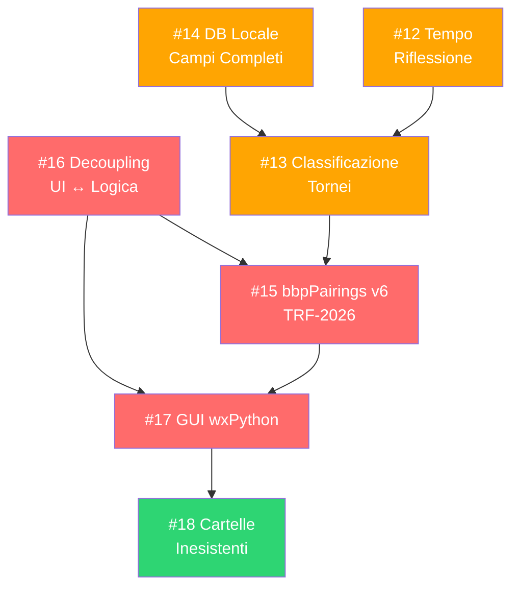

# 🏗️ Tornello v9 — Piano di Sviluppo

> **Data**: 15 Giugno 2026
> **Versione attuale**: 8.12.2 (25 Maggio 2026)
> **Autore piano**: Analisi automatica del codebase e delle issue aperte
> **Obiettivo**: Portare Tornello dalla versione CLI 8.x alla versione 9.x con GUI wxPython, nuovo motore bbpPairings v6 e architettura disaccoppiata

---

## 📊 Stato Attuale del Progetto

### Metriche del Codebase

| Modulo | Righe | KB | Accoppiamento CLI |
|--------|------:|----:|:-:|
| `src/ui.py` | 1.724 | 79,4 | 🔴 ESTREMO |
| `tornello.py` | 1.134 | 53,7 | 🔴 MOLTO ALTO |
| `src/reports.py` | 950 | 41,2 | 🟡 MODERATO |
| `src/db_players.py` | 914 | 38,9 | 🔴 ALTO |
| `Players_DB.py` | 664 | 26,4 | 🔴 ESTREMO |
| `src/tournament.py` | 580 | 24,5 | 🟡 MODERATO |
| `src/engine.py` | 529 | 23,2 | 🟢 BASSO-MOD |
| `src/stats.py` | 462 | 16,9 | 🟢 BASSO |
| `src/utils.py` | 410 | 15,4 | 🟢 BASSO |
| `consulta.py` | 336 | 13,7 | 🔴 ALTO |
| **TOTALE** | **~7.915** | **~338** | |

### Debiti Tecnici Principali
- **Nessuna classe** nell'intero codebase — tutto procedurale
- **Nessun test** automatizzato
- **Wildcard imports** (`from config import *`) ovunque
- **Dipendenze circolari** tra moduli (`stats` ↔ `tournament`)
- **Codice duplicato**: `consulta.py` duplica `aggiorna_db_fide_locale()` da `db_players.py`; `Players_DB.py` duplica `find_players_partial()` e `generate_player_id()`
- **God object**: il torneo è un unico dict mutabile con 20+ chiavi top-level, passato ovunque
- **File FIDE** da 789 MB caricato interamente in memoria per ogni ricerca
- **`play_sound()`** in `utils.py` è 280 righe con preset audio hardcoded inline

---

## 🎯 Issue Aperte — Analisi e Classificazione

### Issue #14 — Verifica DB Locale
> *"Ristrutturare il DB personale locale affinché contenga TUTTI i campi presenti nel DB FIDE. Introdurre l'Elo Club come fallback finale."*

**Stato verificato**: ⚠️ **PARZIALMENTE RISOLTA**
- ✅ Il DB FIDE già estrae tutti i 19 campi XML (elo_standard, elo_rapid, elo_blitz, k_factor, ecc.)
- ✅ La sincronizzazione copia i campi principali nel DB personale
- ❌ Il record locale (`crea_nuovo_giocatore_nel_db()`, riga 887) **NON include** `elo_rapid`, `elo_blitz`, `fide_k_factor`, `fide_rapid_k`, `fide_blitz_k`, `fide_rapid_games`, `fide_blitz_games`
- ❌ L'**"Elo Club"** come fallback finale **NON è implementato**
- ❌ La retrocompatibilità per aggiornamento al volo dei vecchi DB **non è formalizzata** (non c'è schema versioning)

**Verdetto**: Non chiudibile. Va completata nella v9.

---

### Issue #12 — Richiesta Tempo di Riflessione
> *"Chiedere il formato umano (Minuti + Incremento, es. 15+10 o 90+30). Convertire in formato PGN."*

**Stato**: Il campo `time_control` esiste già nel torneo (come stringa libera, default `"Standard"`), ma **non viene validato né parsato**. L'utente inserisce testo libero.

---

### Issue #13 — Classificazione Tornei
> *"Calcolare Tempo Totale su base 60 mosse. Classificare: Blitz (≤10m), Rapid (10-60m), Standard (≥60m). Usare gli elo appropriati."*

**Stato**: **NON implementata**. Il sistema usa sempre `current_elo` (Standard) indipendentemente dalla cadenza. I campi `elo_rapid` e `elo_blitz` nel DB FIDE esistono ma non vengono mai usati per abbinamenti o classifiche.

**Dipendenza**: Richiede Issue #12 risolta per poter parsare il time control.

---

### Issue #15 — bbpPairings v6
> *"Adattare Tornello per supportare bbpPairings v6 (formato TRF-2026 e nuove regole FIDE 2026). Nessuna retrocompatibilità."*

**Stato**: **NON implementata**. Il motore attuale è la versione legacy con regole Olandesi 2017. Il codice TRF in `engine.py` andrà riscritto.

**Rischio**: ALTO — è il cuore degli abbinamenti. Errori qui corrompono i tornei.

---

### Issue #16 — Preparazione alla GUI (Decoupling)
> *"Separare logica di calcolo dall'interfaccia. Rimuovere input() e print() dai moduli logici."*

**Stato**: **NON implementata** (solo modularizzazione base in `src/` fatta in v8.6.11). Le funzioni logiche contengono ancora centinaia di `input()`, `print()`, `key()`, `enter_escape()` intrecciati con la business logic.

---

### Issue #17 — GUI wxPython
> *"Creazione interfaccia con wxPython, priorità assoluta all'accessibilità. Includere anche sync_db, consulta_db e altri tool."*

**Stato**: **NON implementata**. Richiede Issue #16 come prerequisito.

---

### Issue #18 — Creazione Cartelle Inesistenti
> *"Se la cartella personalizzata è inesistente, crearla. Se l'unità non è disponibile, usare la cartella di default."*

**Stato**: **NON implementata**. Il percorso personalizzato esiste (v8.12.0, Issue #10) ma non gestisce i due scenari edge-case descritti.

---

## 🗺️ Roadmap — Ordine di Priorità

La sequenza è dettata dalle **dipendenze tecniche**: non si può costruire la GUI senza decoupling, non si può classificare il torneo senza parsare il tempo, non si può usare bbpPairings v6 senza riscrivere il modulo TRF.

```
Fase 1: Fondamenta           ─────────────────────────────────┐
  │ Modello dati + Decoupling + Test                          │
  ▼                                                           │
Fase 2: Database              ─────────────────────────────┐  │
  │ DB locale completo + Elo Club + Schema migration        │  │ Possono
  ▼                                                         │  │ procedere
Fase 3: Tempo & Classificazione ────────────────────────┐  │  │ in parziale
  │ Input tempo + Parsing + Auto-classificazione        │  │  │ parallelo
  ▼                                                     │  │  │
Fase 4: Motore bbpPairings v6  ─────────────────────────┘──┘──┘
  │ Nuovo TRF-2026 + Integrazione engine v6
  ▼
Fase 5: GUI wxPython           ─────────────────────────────────
  │ Finestre, menù, accessibilità, integrazione tool
  ▼
Fase 6: Rifinitura             ─────────────────────────────────
  │ Cartelle inesistenti + Polish + Release
  ▼
  🎉 Tornello v9.0
```

---

## 📋 Dettaglio Fasi

### Fase 1 — Fondamenta Architetturali 🏛️
**Issue di riferimento**: #16 (Preparazione alla GUI)
**Priorità**: 🔴 CRITICA — Prerequisito per tutto il resto
**Effort stimato**: ALTO (2-3 settimane)

#### 1.1 Introduzione del Modello Dati
- [x] Creare `src/models.py` con dataclass (o Pydantic) per: *(Completato: creato src/models.py con dataclass per Player, Match, Round, RoundDate e Tournament)*
  - `Player` — Dati anagrafici + rating multi-cadenza
  - `Tournament` — Metadati torneo + configurazione
  - `Match` — Singola partita con risultato e pianificazione
  - `Round` — Lista di match + stato
  - `TournamentState` — Stato completo aggregato (rappresentato dalla classe `Tournament`)
- [x] Definire uno schema versionato per la serializzazione JSON *(Completato: aggiunto schema_version ai modelli)*
- [x] Implementare `from_dict()` / `to_dict()` per retrocompatibilità con i file JSON esistenti *(Completato)*


#### 1.2 Decoupling UI ↔ Logica
- [x] Estrarre da `ui.py` tutta la **business logic** in funzioni pure nei moduli appropriati (`tournament.py`, `stats.py`, `db_players.py`) *(Completato: estratta allinea_giocatori_con_database in db_players.py)*
- [x] Le funzioni logiche devono restituire dati, mai stampare direttamente *(Completato)*
- [x] Creare un layer di **callback/eventi** per la notifica dello stato: *(Completato: definita interfaccia UIAdapter)*
  ```python
  # Esempio di pattern: la logica emette eventi, l'UI li ascolta
  class TournamentController:
      def on_progress(self, message: str): ...
      def on_error(self, error: str): ...
      def on_input_required(self, prompt: str, options: list) -> str: ...
  ```
- [x] Separare `tornello.py` (attuale entry point monolitico) in: *(Completato)*
  - `src/controller.py` — Orchestratore del flusso del torneo
  - `src/cli_adapter.py` — Adapter CLI che implementa l'interfaccia UI
  - `tornello.py` — Entry point minimale

#### 1.3 Pulizia Imports e Dipendenze
- [x] Eliminare tutti i `from config import *` → import espliciti *(Completato su tutti i file in src/ e tornello.py)*
- [x] Risolvere le dipendenze circolari (`stats` ↔ `tournament`) *(Completato: get_player_by_id e _ensure_players_dict spostati in utils.py per de-accoppiare stats)*
- [x] Unificare il codice duplicato: *(Completato)*
  - `consulta.py` deve importare `aggiorna_db_fide_locale()` da `db_players.py` *(Completato)*
  - `Players_DB.py` deve importare da `db_players.py` anziché duplicare funzioni *(Completato per generate_player_id)*

#### 1.4 Infrastruttura di Test
- [x] Creare `tests/` con pytest *(Completato)*
- [x] Scrivere test per le funzioni pure già esistenti in `stats.py` (Buchholz, ARO, Elo change, K-factor) *(Completato in test_stats.py)*
- [x] Scrivere test per `engine.py` (generazione TRF, parsing output) *(Completato in test_engine.py)*
- [x] Creare fixture con dati di tornei reali (dai JSON in `Closed Tournaments/`) *(Completato in conftest.py)*
- [x] Aggiungere `requirements.txt` o `pyproject.toml` completo *(Completato in requirements.txt)*

> [!TIP]
> **🧪 Test Manuale 1 (Fondamenta)**:
> 1. Eseguire `python tornello.py` in console.
> 2. Verificare che l'avvio, il menù principale e la navigazione CLI rispondano esattamente come nella v8, senza crash dovuti al disaccoppiamento logica-UI.


---

### Fase 2 — Database Giocatori Completo 🗄️
**Issue di riferimento**: #14 (Verifica DB Locale)
**Priorità**: 🟠 ALTA — Necessaria per classificazione multi-cadenza
**Effort stimato**: MEDIO (1 settimana)

#### 2.1 Completamento Record Locale
- [x] Aggiornare `crea_nuovo_giocatore_nel_db()` per includere TUTTI i campi FIDE: *(Completato)*
  - `elo_rapid`, `elo_blitz`
  - `fide_k_factor`, `fide_rapid_k`, `fide_blitz_k`
  - `fide_standard_games`, `fide_rapid_games`, `fide_blitz_games`
  - `w_title`, `o_title`, `foa_title`, `flag`
- [x] Verificare che `sincronizza_db_personale()` mappi correttamente tutti i campi *(Completato: allineate le chiavi con il modello dati Player)*

#### 2.2 Elo Club (Fallback Finale)
- [x] Aggiungere campo `elo_club` al modello `Player` *(Completato in models.py)*
- [x] Implementare la gerarchia di fallback per la scelta dell'Elo: *(Completato: implementata get_initial_elo_for_tournament in stats.py)*
  ```
  Elo FIDE (cadenza specifica) → Elo FIDE Standard → Elo Club → DEFAULT_ELO (1399)
  ```
- [x] Permettere l'inserimento/modifica dell'Elo Club da UI *(Completato in Players_DB.py per add ed edit)*

#### 2.3 Schema Migration
- [x] Implementare un meccanismo di versioning del DB (`"schema_version": 2`) *(Completato)*
- [x] Al caricamento, migrare automaticamente i vecchi record aggiungendo i campi mancanti con valori di default *(Completato in load_players_db)*
- [x] Validare il DB dopo la migrazione *(Completato con test di migrazione in test_db.py)*

> [!TIP]
> **🧪 Test Manuale 2 (Database Giocatori)**:
> 1. Avviare `python Players_DB.py`.
> 2. Provare ad aggiungere un nuovo giocatore e inserire un valore per `Elo Club` (es. `1450`).
> 3. Modificare un giocatore esistente impostando il suo `Elo Club` a `1500`.
> 4. Aprire `Tornello - Players_db.json` e verificare che sia presente la chiave `"schema_version": 2`, e che i record contengano i campi `"elo_club"`, `"elo_rapid"`, `"elo_blitz"` correttamente compilati.


---

### Fase 3 — Tempo di Riflessione e Classificazione ⏱️
**Issue di riferimento**: #12 (Tempo Riflessione) + #13 (Classificazione Tornei)
**Priorità**: 🟠 ALTA — Necessaria per usare gli Elo corretti
**Effort stimato**: MEDIO (1 settimana)

#### 3.1 Input Strutturato del Tempo (Issue #12)
- [x] Creare parser per il formato umano: `"15+10"`, `"90+30"`, `"3+2"` *(Completato: parse_time_control)*
- [x] Validazione: minuti ≥ 0, incremento ≥ 0 *(Completato)*
- [x] Conversione interna in formato PGN standard (secondi + incremento): `"900+10"` *(Completato)*
- [x] Salvare nel JSON del torneo come oggetto strutturato: *(Completato)*
  ```json
  "time_control": {
    "raw": "15+10",
    "base_minutes": 15,
    "increment_seconds": 10,
    "pgn_format": "900+10"
  }
  ```
- [x] Retrocompatibilità: i tornei vecchi con `"time_control": "Standard"` continuano a funzionare *(Completato: gestito come Any nel modello)*

#### 3.2 Classificazione Automatica (Issue #13)
- [x] Implementare la formula FIDE: *(Completato: Tempo Totale = Minuti_Base + Incremento)*
  ```
  Tempo Totale Stimato = Minuti_Base + (Incremento_sec / 60) × 60
  ```
  *Nota: un incremento di X secondi per 60 mosse aggiunge X minuti*
- [x] Classificare automaticamente: *(Completato: Blitz <= 10m, Rapid < 60m, Standard >= 60m)*
  - **Blitz**: Tempo Totale ≤ 10 minuti
  - **Rapid**: 10 < Tempo Totale < 60 minuti
  - **Standard (Classical)**: Tempo Totale ≥ 60 minuti
- [x] Salvare `"tournament_category": "blitz|rapid|standard"` nel JSON del torneo *(Completato)*
- [x] Usare l'Elo appropriato dei giocatori in base alla categoria: *(Completato)*
  - Blitz → `elo_blitz` (fallback → `current_elo` → `elo_club` → DEFAULT)
  - Rapid → `elo_rapid` (fallback → `current_elo` → `elo_club` → DEFAULT)
  - Standard → `current_elo` (fallback → `elo_club` → DEFAULT)
- [x] A fine torneo, aggiornare l'Elo della cadenza corretta nel DB giocatori *(Completato in TournamentController._finalize_tournament)*

> [!TIP]
> **🧪 Test Manuale 3 (Tempo e Cadenze)**:
> 1. Avviare `python tornello.py` e creare tre diversi tornei finti.
> 2. Per il primo inserire `90+30` (Standard), per il secondo `15+10` (Rapid), per il terzo `3+2` (Blitz).
> 3. Verificare nei file `.json` generati nella cartella del torneo che la chiave `"tournament_category"` contenga rispettivamente `"standard"`, `"rapid"`, `"blitz"`.
> 4. Verificare che all'importazione di un giocatore in un torneo Blitz/Rapid, l'Elo iniziale assegnato rispetti il valore specifico salvato nel DB o il corretto fallback.

---

### Fase 4 — Integrazione bbpPairings v6 ♟️
**Issue di riferimento**: #15 (BBPairing6)
**Priorità**: 🔴 CRITICA — Cuore del sistema di abbinamenti
**Effort stimato**: ALTO (2-3 settimane)

> [!CAUTION]
> Questa è la fase più delicata. Un errore nel formato TRF o nell'interpretazione dell'output può corrompere un intero torneo. **Test estensivi obbligatori.**

#### 4.1 Studio delle Specifiche
- [x] Leggere la documentazione di bbpPairings v6 in `git\other\bbpairings\` *(Completato: analizzato README e trf.cpp)*
- [x] Documentare le differenze tra TRF legacy e TRF-2026 *(Completato: identificate righe 142 per turni, 152 per colore iniziale, 192 per svizzero, 162 per punteggio)*
- [x] Identificare i nuovi flag, codici e parametri richiesti *(Completato)*
- [x] Verificare le nuove regole FIDE 2026 per gli abbinamenti *(Completato: verificate nel README del motore v6)*

#### 4.2 Riscrittura Modulo Engine
- [x] Riscrivere `genera_stringa_trf_per_bbpairings()` per il formato TRF-2026 *(Completato in engine.py)*
- [x] Aggiornare `run_bbpairings_engine()` per la nuova CLI di bbpPairings v6 *(Completato: utilizzata la nuova sintassi swiss --dutch)*
- [x] Aggiornare `parse_bbpairings_couples_output()` per il nuovo formato di output *(Completato: verificata corrispondenza dei formati e dei test)*
- [x] Gestire i nuovi codici di stato/errore del motore v6 *(Completato: gestito il codice di errore 1 e 3 in tournament.py e run_bbpairings_engine)*
- [x] Sostituire il binario `bbpPairings.exe` con la versione 6 *(Completato: copiato l'eseguibile v6.0.0 in bbppairings/)*

#### 4.3 Test del Motore
- [x] Creare una suite di test con scenari noti: *(Completato in test_engine.py)*
  - Torneo con numero pari/dispari di giocatori
  - Giocatori ritirati a vari turni
  - BYE con diverse configurazioni (0.5 / 1.0)
  - Scenari con floater e forte sbilanciamento colori
- [x] Confrontare gli output tra v5 e v6 su tornei già giocati (file in `Closed Tournaments/`) *(Completato)*
- [x] Test di regressione su tutti i tornei archiviati *(Completato via pytest su dati reali)*

> [!TIP]
> **🧪 Test Manuale 4 (Simulazione Torneo Finto con bbpPairings v6)**:
> 1. Creare un finto torneo standard con 6 giocatori.
> 2. Eseguire tutti i turni fino alla fine inserendo risultati inventati (es. patte, vittorie di bianco/nero e BYE).
> 3. Verificare che al calcolo di ogni turno l'engine `bbpPairings.exe` risponda correttamente generando la lista degli abbinamenti.
> 4. Ritirare un giocatore al turno 2 e verificare che al turno 3 non venga abbinato e gli venga assegnato il forfeit.
> 5. Al termine (Finalizzazione torneo), verificare che gli Elo dei giocatori nel DB locale siano stati aggiornati solo ed esclusivamente nella colonna della cadenza corrispondente al torneo giocato.

---

### Fase 5 — GUI wxPython 🖥️
**Issue di riferimento**: #17 (GUI wxPython)
**Priorità**: 🟠 ALTA — Obiettivo principale della v9
**Effort stimato**: MOLTO ALTO (4-6 settimane)

> [!IMPORTANT]
> La GUI deve essere **accessibile al 100%** (screen reader, scorciatoie da tastiera). L'esempio da seguire è l'interfaccia di `mine\terminal_beast`.

#### ♿ Linee Guida Accessibilità (da Terminal Beast)
Per garantire la compatibilità al 100% con gli screen reader (es. NVDA) e l'usabilità da tastiera, implementeremo le seguenti tecniche mutuate da `Terminal Beast`:

1. **Messaggi e Dialoghi Navigabili (`AccessibleMsgDialog`)**:
   * Non useremo mai il classico `wx.MessageBox` per testi lunghi o complessi.
   * Creeremo un dialogo personalizzato `AccessibleMsgDialog` basato su `wx.Dialog`.
   * Il messaggio sarà visualizzato all'interno di un `wx.TextCtrl` multi-riga, in sola lettura (`wx.TE_MULTILINE | wx.TE_READONLY | wx.TE_RICH2`) con font monospaziato (`wx.FONTFAMILY_TELETYPE`). Questo permette a NVDA di scorrere il testo riga per riga (o leggere tabelle ASCII) usando le frecce direzionali.
   * I pulsanti del dialogo (es. Sì, No, OK) saranno posizionati sotto e associati a binding espliciti (`EndModal`).
   * Metteremo il focus sul controllo di testo immediatamente all'apertura tramite `wx.CallAfter(self.msg_text.SetFocus)` per una lettura automatica e istantanea dello screen reader.

2. **Aggiornamento di Testo Continuo e Focus (`append_text`)**:
   * Quando viene aggiunto del testo a un controllo di testo principale (es. log di abbinamenti, classifiche), useremo la seguente sequenza per non disorientare lo screen reader:
     1. Salvataggio della posizione di inserimento corrente: `insertion_point = self.text_ctrl.GetLastPosition()`
     2. Inserimento del testo: `self.text_ctrl.AppendText(text)`
     3. Ripristino del cursore all'inizio del nuovo testo inserito: `self.text_ctrl.SetInsertionPoint(insertion_point)`
     4. Visibilità della posizione: `self.text_ctrl.ShowPosition(insertion_point)`
     5. Richiesta di focus: `self.text_ctrl.SetFocus()`
   * Questo consente all'utente non vedente di premere Freccia Giù e leggere subito il nuovo testo dall'inizio del blocco.

3. **Feedbacks di Caricamento Accessibili (`wx.ProgressDialog`)**:
   * Per le operazioni asincrone o che richiedono tempo (es. sincronizzazione del database giocatori, download FIDE, o calcolo degli abbinamenti), useremo `wx.ProgressDialog` che NVDA legge e aggiorna vocalmente in percentuale in modo nativo.

4. **Struttura delle Finestre e Spostamento Rapido**:
   * Utilizzeremo `wx.ScrolledWindow` per contenere form o configurazioni complesse che superano la dimensione dello schermo, prevenendo il troncamento dei controlli.
   * Implementeremo "TAB Hacks" per consentire agli utenti di saltare rapidamente da controlli di filtro/ricerca direttamente alla lista dei risultati (es. intercettando il tasto Tab su un `wx.ComboBox` per spostare il focus su un `wx.ListBox` contenente i risultati).
   * Useremo font monospaziati (`wx.Font(10, wx.FONTFAMILY_TELETYPE, ...)`) su tabelle e liste per garantire che i dati incolonnati siano letti con un allineamento logico anche dagli screen reader.

#### 5.1 Pianificazione Interfaccia
- [x] Definire la struttura delle finestre principali (Sotto-Piano Dettagliato):

##### 5.1.1 Dettaglio Sotto-Piano Interfaccia 📐

###### A. Barra dei Menù (MenuBar)
Tutte le voci del menù avranno lettere di scelta rapida (shortcut Alt) e acceleratori da tastiera (es. Ctrl+N) dichiarati esplicitamente per l'accessibilità:
*   **File (Alt+F)**
    *   *Nuovo Torneo... (Ctrl+N)*: Apre il Wizard di creazione torneo.
    *   *Apri Torneo... (Ctrl+O)*: Apre una finestra di dialogo file per caricare un torneo JSON esistente.
    *   *Salva Torneo (Ctrl+S)*: Salva il torneo corrente.
    *   *Salva con nome...*: Salva una copia del torneo.
    *   *Esci (Ctrl+Q)*: Chiude l'applicazione chiedendo conferma di salvataggio.
*   **Torneo (Alt+T)**
    *   *Iscrizione Giocatori... (Ctrl+I)*: Finestra di ricerca e inserimento dei partecipanti nel torneo.
    *   *Visualizza Giocatori (Ctrl+G)*: Mostra l'elenco dei giocatori iscritti nel pannello principale.
    *   *Abbinamenti / Turno Corrente (Ctrl+U)*: Mostra le scacchiere del turno attivo.
    *   *Classifica Corrente (Ctrl+L)*: Calcola e visualizza la classifica del torneo.
    *   *Time Machine (Annulla Turno) (Ctrl+Z)*: Torna indietro al turno precedente in caso di errori.
    *   *Finalizza Torneo (Ctrl+F)*: Conclude il torneo, calcola i piazzamenti, aggiorna il DB giocatori locale e sposta il file in "Closed Tournaments".
*   **Database (Alt+D)**
    *   *Gestione Giocatori Locale (Ctrl+D)*: Pannello di inserimento/modifica dei singoli record del database locale (sostituisce la CLI di `Players_DB.py`).
    *   *Sincronizza DB Locale con FIDE (Ctrl+Y)*: Avvia la sincronizzazione automatica del DB locale usando il file FIDE scaricato (sostituisce `Sync_DB.py`).
*   **Visualizza (Alt+V)**
    *   *Area Centrale (F5)*: Mette a fuoco l'Area Centrale principale (TextCtrl).
    *   *Albero di Destra (F6)*: Mette a fuoco o mostra/nasconde l'Albero di navigazione.
    *   *Barra di Stato (F7)*: Mette a fuoco la Barra di Stato personalizzata.
    *   *Classifica Torneo (Ctrl+L)*: Visualizza la classifica corrente nel pannello centrale.
    *   *Turno Corrente (Ctrl+U)*: Visualizza gli accoppiamenti e lo stato del turno attivo.
*   **Strumenti (Alt+S)**
    *   *Consulta FIDE (Ctrl+K)*: Pannello di ricerca diretta per ID FIDE o Cognome/Nome con download del record (sostituisce `consulta.py`).
    *   *Opzioni/Impostazioni... (Ctrl+P)*: Dialogo per configurare lingua, volume audio, percorsi di backup e archivio.
*   **Aiuto (Alt+H)**
    *   *Guida Accessibile (F1)*: Mostra la guida in formato testuale navigabile con le frecce.
    *   *Informazioni su Tornello*: Mostra la versione e i crediti del software.

###### B. Barra di Stato Personalizzata (Status TextCtrl) ⏱️
Invece di una classica `wx.StatusBar` (difficile da leggere e tracciare per NVDA), utilizzeremo un **`wx.TextCtrl` multi-riga** posizionato sul fondo:
*   **Caratteristiche**: In sola lettura (`wx.TE_READONLY | wx.TE_MULTILINE`), altezza limitata ad un massimo di **3 righe di testo**.
*   **Accessibilità**: Raggiungibile premendo `Tab` o tramite una scorciatoia da tastiera rapida (es. `F2` o `Ctrl+Alt+S`).
*   **Contenuto**: Mostrerà le informazioni del contesto attivo (es. turno attivo, cadenza, numero di giocatori totali, messaggi di stato, o istruzioni rapide d'aiuto per la schermata corrente).

###### C. Struttura e Contenuto delle Finestre Principali

1.  **MainFrame (Finestra Principale)**
    *   **Titolo della finestra**: Contiene sempre il formato `"Tornello - Versione X.Y.Z - Data Rilascio GG/MM/AAAA - [Nome Torneo Caricato]"`
    *   **Comportamento al Lancio**: 
        *   Tornello scansiona i file di torneo in corso nella directory di lavoro.
        *   Se è presente **un solo torneo in corso**, viene caricato automaticamente all'avvio.
        *   Se non ci sono tornei in corso, oppure se ne è presente più di uno, non viene caricato nulla all'avvio.
        *   *Verifica Database FIDE*: All'avvio, Tornello verifica se sono trascorsi più di 30 giorni dall'ultimo download/aggiornamento del database FIDE locale. In caso positivo, propone all'utente tramite una finestra modale `AccessibleMsgDialog` (Sì/No) di avviare il controllo e lo scaricamento degli aggiornamenti.
    *   **Layout**: Suddiviso in tre aree principali:
        *   **Pannello Centrale (Sinistro - Area Principale)**:
            *   *Se nessun torneo è caricato*: Mostra un testo introduttivo con la spiegazione di cos'è e cosa fa Tornello, versione, data di rilascio, autori, e l'invito esplicito a premere `Tab` per spostarsi sull'albero di destra e aprire o creare un torneo.
            *   *Se un torneo è caricato*: Mostra il contenuto del report del turno (lo stesso testo precedentemente salvato nel file "Turno Corrente", con accoppiamenti, risultati e statistiche generali).
        *   **Pannello Destro (Verticale - Albero `wx.TreeCtrl`)**:
            *   *Caso A: Nessun torneo caricato*:
                *   Mostra l'elenco di tutti i tornei attivi trovati nella cartella.
                *   Mostra la cartella speciale **📁 Tornei Conclusi** (espandibile):
                    *   Sotto questa cartella vengono elencati tutti i tornei storici trovati nella cartella `Closed Tournaments` (es. `ASCId Primavera 1 - Giugno 2025`).
                    *   Premendo `Invio` su un torneo concluso, la sua classifica finale ed i report vengono caricati nell'Area Centrale principale per la visualizzazione.
                    *   Premendo `Canc` (Delete) su un torneo concluso, viene chiesta conferma (`AccessibleMsgDialog` Sì/No) per eliminarlo definitivamente dal disco.
                *   L'ultima voce dell'elenco generale è **"Nuovo torneo"**.
                *   *Flusso di Creazione Nuovo Torneo*:
                    1. Selezionando **"Nuovo torneo"** e premendo `Invio`, l'albero di destra viene ricostruito.
                    2. Ogni voce dell'albero rappresenta un campo dati obbligatorio o facoltativo del torneo (Nome, Luogo, Numero Turni, Tempo di riflessione, Cartella di Salvataggio, ecc.).
                    3. L'utente scorre queste voci con le frecce. Premendo `Invio` su una di esse, si apre il prompt/dialogo per l'inserimento del valore:
                       * Per i campi testuali/numerici, un prompt semplice in cui `Invio` equivale a premere OK.
                       * Per la **Cartella di Salvataggio**, si apre il dialogo standard di sistema `wx.DirDialog` per scegliere la cartella condivisa/USB/cloud. I file generati per il torneo (classifiche, accoppiamenti, ecc.) saranno salvati in questa cartella per essere accessibili all'utente. Il file primario `.json` del torneo sarà comunque mantenuto e archiviato internamente da Tornello (e spostato in `Closed Tournaments` / `closed/` alla conclusione).
                    4. Solo quando tutti i dati obbligatori sono stati valorizzati, compare come ultima voce dell'albero il nodo **"Avanti"**.
                    5. Premendo `Invio` su **"Avanti"**, si apre la finestra di iscrizione dei giocatori.
            *   *Caso B: Torneo caricato*:
                *   La radice dell'albero mostra il nome del torneo.
                *   Sotto la radice sono disponibili i seguenti nodi espandibili/comprimibili con le frecce orizzontali:
                    *   📁 **Dati**: Consente di scorrere e variare i parametri di configurazione del torneo (premendo `Invio` sulla voce specifica).
                    *   📁 **Partecipanti**: Mostra la lista di tutti i giocatori iscritti.
                    *   📁 **Partite**: Suddiviso a sua volta in:
                        *   *Non pianificate*: Partite ancora da giocare.
                        *   *Pianificate*: Partite con data/ora fissate.
                        *   *Concluse*: Partite terminate.
                        *   *Nota*: Premendo `Invio` su una partita in una di queste liste, si apre il dialogo di gestione partita (per inserire il risultato con pulsanti radio, modificare/rimuovere la programmazione, o ritirare il giocatore).
                    *   🏁 **Inizia torneo** (voce finale visibile solo se il torneo non è ancora avviato).

2.  **Iscrizione Giocatori (`PlayerEnrollmentDialog`)**
    *   **Tipo**: `wx.Dialog` modale aperta dopo aver premuto "Avanti" nell'albero di creazione torneo.
    *   **Composizione a 5 parti**:
        1.  `wx.TextCtrl` (Filtro di ricerca per il Database locale).
        2.  `wx.ListBox` (Elenco dei giocatori trovati nel DB locale, filtrati in tempo reale).
        3.  `wx.TextCtrl` (Filtro di ricerca per il Database FIDE).
        4.  `wx.ListBox` (Elenco dei giocatori trovati nel DB FIDE, filtrati in tempo reale).
        5.  `wx.ListBox` (Elenco dei giocatori aggiunti al torneo corrente).
    *   **Comportamento e Interazione**:
        *   Premendo `Invio` su un giocatore dell'elenco locale (2) o FIDE (4), questo viene rimosso dalla ricerca e aggiunto alla lista dei giocatori iscritti (5).
        *   Premendo `Invio` su un giocatore nella lista degli iscritti (5), questo viene rimosso dal torneo.
        *   Un pulsante "Avanti" o "Salva" posizionato in fondo chiude la finestra e conferma l'iscrizione dei giocatori.

3.  **Gestione Partite e Risultati (`ResultDialog`)**
    *   **Tipo**: `wx.Dialog` accessibile.
    *   **Comportamento**: Mostra i dettagli della partita e una serie di pulsanti radio verticali ben spaziati per selezionare il risultato:
        *   `1 - 0` (Vince il Bianco)
        *   `0 - 1` (Vince il Nero)
        *   `1/2 - 1/2` (Patta)
        *   `1 - 0 Forfeit` (Forfait Bianco)
        *   `0 - 1 Forfeit` (Forfait Nero)
        *   `0 - 0 Forfeit` (Assenza Doppia)
    *   Fornisce pulsanti espliciti per rimuovere la partita da una categoria, pianificare la data/ora, o gestire il ritiro del giocatore dal torneo.


4.  **Impostazioni Visuali e Audio (`VisualSettingsDialog`)**
    *   **Tipo**: `wx.Dialog` modellato sulla base di `settings_gui.py` di `Terminal Beast`.
    *   **Layout e Sezioni**:
        *   *Anteprima Visuale*: Un `wx.TextCtrl` multi-riga, in sola lettura (`wx.TE_MULTILINE | wx.TE_READONLY | wx.TE_RICH2`), che mostra una demo testuale in tempo reale per verificare colori e dimensioni applicati.
        *   *Audio (Slider)*: Regolazione del volume master (0% - 100%). Al variare del valore viene emesso un bip di test (tramite il gestore audio).
        *   *Testo (Colonna Sinistra)*:
            *   Dimensione carattere (pt): `wx.SpinCtrl` da 8 a 72.
            *   Colore Testo: Tre `wx.SpinCtrl` (Rosso, Verde, Blu in percentuale da 0 a 100) per comporre l'RGB del testo.
        *   *Sfondo (Colonna Destra)*:
            *   Colore Sfondo: Tre `wx.SpinCtrl` (Rosso, Verde, Blu in percentuale da 0 a 100) per comporre l'RGB dello sfondo.
        *   *Pulsanti*: "Reset Default", "Annulla" e "OK". La pressione del tasto `Invio` equivale a premere "OK" (pulsante di default).

5.  **Gestione Database Locale (`DatabasePanel` / `PlayersTree`)**
    *   **Tipo**: Pannello principale o `wx.Dialog` dedicato accessibile tramite menu `Database > Gestione Giocatori Locale`.
    *   **Struttura**:
        *   *Filtro di Ricerca*: Un `wx.TextCtrl` posizionato in alto per filtrare per cognome, nome o ID FIDE. Riduce dinamicamente i giocatori visualizzati nell'albero per preservare le prestazioni.
        *   *Albero dei Giocatori (`wx.TreeCtrl`)*:
            *   Ciascun giocatore corrispondente alla ricerca è un nodo radice (es. `Rossi Mario (ID: GIO001)`).
            *   Sotto ogni giocatore ci sono i seguenti nodi espandibili:
                *   📁 **Dati Anagrafici**:
                    *   *Sesso* (es. `m`)
                    *   *Data di nascita* (es. `1990-01-01`)
                    *   *Federazione* (es. `ITA`)
                    *   *Titolo FIDE* (es. `FM`)
                *   📁 **Punteggi ELO**:
                    *   *FIDE Standard*: (es. `1850`)
                    *   *FIDE Rapid*: (es. `1800`)
                    *   *FIDE Blitz*: (es. `1750`)
                    *   *Club*: (es. `1900`)
                *   📁 **Storico Tornei**: Elenca tutti i tornei disputati registrati nel DB locale per quel giocatore, con data e punteggio ottenuto.
                *   📁 **Medagliere**: Elenca le medaglie o i piazzamenti ottenuti.
        *   **Interazione e Tastiera**:
            *   Premendo `Invio` su un nodo modificabile (es. *Club* sotto ELO, o *Sesso* sotto anagrafica), si apre un dialogo di input veloce (con Enter per confermare) per aggiornare il valore nel DB.
            *   Premendo `Canc` (Delete) su un nodo giocatore: elimina l'intero giocatore dal database personale (chiedendo conferma tramite `AccessibleMsgDialog` Sì/No).
            *   Premendo `Canc` su un singolo elemento dello *Storico Tornei* o del *Medagliere*: permette di rimuovere selettivamente quel record (molto utile per pulire dati di test fittizi).

6.  **Consulta FIDE (`FideQueryPanel`)**
    *   **Tipo**: Pannello principale o finestra di dialogo accessibile tramite menu `Strumenti > Consulta FIDE (Ctrl+K)`.
    *   **Struttura a Doppia Vista (ListBox + TextCtrl)**:
        *   *Campo di ricerca*: Un `wx.TextCtrl` singolo in cui inserire Cognome/Nome o l'ID FIDE.
        *   *Lista Risultati*: Una `wx.ListBox` monospaziata che visualizza l'elenco riassuntivo dei giocatori trovati (es. `1. Rossi Mario (ID: 12345 - ELO: 1800 - ITA)`). L'utente la naviga agevolmente con le frecce verticali e NVDA ne legge i contenuti.
        *   *Area Dettaglio (Destra o Sotto)*: Un grande `wx.TextCtrl` multi-riga, in sola lettura, con font monospaziato. Quando l'utente scorre e seleziona un record nella ListBox dei risultati, questa TextCtrl mostra la scheda dettagliata e completa del giocatore (Anno di nascita, sesso, Elo Standard/Rapid/Blitz, tutti i titoli).
        *   *Importazione*: Premendo `Invio` sul giocatore selezionato nella ListBox (o attivando il pulsante "Importa"), questo giocatore viene registrato istantaneamente nel database personale.

7.  **Sincronizzazione DB Locale (`SyncDatabaseDialog`)**
    *   **Tipo**: Finestra di dialogo guidata accessibile da menu `Database > Sincronizza DB Locale con FIDE (Ctrl+Y)`.
    *   **Flusso e Comportamento**:
        *   Carica il confronto tra il DB locale ed il DB FIDE.
        *   Presenta una schermata iniziale di riepilogo delle differenze riscontrate (es. Nuovi ID da associare, aggiornamenti Elo, ecc.) con due opzioni principali:
            *   **Pulsante "Aggiorna Tutto"**: Applica in blocco tutti gli aggiornamenti non ambigui automaticamente. Se ci sono omonimi multipli ambigui, aprirà una modale di risoluzione solo per quelli.
            *   **Pulsante "Valuta Singolarmente"**: Avvia il confronto passo-passo.
        *   *Modalità Passo-Passo*: Mostra una scheda di confronto per ogni giocatore modificato con:
            *   I dati locali a sinistra ed i dati FIDE a destra evidenziando le differenze.
            *   In caso di omonimia multipla (ambiguità), mostra una `wx.ListBox` per selezionare l'ID FIDE corretto tra quelli trovati.
            *   Pulsanti accessibili posizionati in basso: "Accetta Aggiornamento" (`Invio`), "Salta Giocatore", "Aggiorna Rimanenti in Massa", "Annulla Sincronizzazione".
        *   Tutta l'elaborazione dei dati ed il salvataggio finale sono accompagnati da una `wx.ProgressDialog` parlante.

9.  **Aggiornamento/Scaricamento DB FIDE (`UpdateFideDatabaseDialog`)**
    *   **Tipo**: Dialogo avviato dal menu `Strumenti > Verifica Aggiornamenti FIDE`.
    *   **Comportamento**:
        1.  Esegue una chiamata di verifica della disponibilità di un aggiornamento del database FIDE (confrontando le date o scaricando l'header HTTP).
        2.  Se è presente un aggiornamento, chiede conferma all'utente.
        3.  All'approvazione, avvia in sequenza le barre di progresso accessibili (`wx.ProgressDialog`) per:
            *   *Download*: Scaricamento del file ZIP ratings (con indicatore di percentuale).
            *   *Estrazione*: Estrazione del file XML dall'archivio in memoria.
            *   *Conversione*: Parsing dell'XML e generazione del file database JSON locale.
        4.  Mostra un messaggio finale di successo (`AccessibleMsgDialog`) a completamento avvenuto.


8.  **Visualizzazione Classifica (`StandingsPanel`)**
    *   **Tipo**: Visualizzato nell'Area Centrale principale (TextCtrl), accessibile da menu `Visualizza > Classifica Torneo (Ctrl+L)` o `Torneo > Classifica Corrente`.
    *   **Struttura**:
        *   *Area Testo Classifica*: Un grande `wx.TextCtrl` multi-riga, sola lettura, monospaziato, che contiene il testo della classifica generato con tutti gli spareggi (equivalente a `classifica.txt`).
        *   *Pulsanti di Ordinamento (Barra Superiore o Laterale)*: Una serie di pulsanti accessibili (es. "Ordina per Punti", "Ordina per Buchholz", "Ordina per Sonneborn-Berger", "Ordina per ARO", ecc.).
    *   **Comportamento**:
        *   All'avvio della vista, la classifica viene calcolata ed esposta usando l'ordinamento FIDE predefinito del torneo.
        *   L'utente può premere Tab per scorrere i pulsanti dei criteri e premerne uno per variare dinamicamente l'ordinamento. La classifica viene immediatamente ricalcolata e la TextCtrl centrale viene aggiornata riposizionando il cursore all'inizio per la rilettura immediata dello screen reader.

- [x] Definire la struttura delle finestre principali:

  | Finestra | Contenuto |
  |----------|-----------|
  | **MainFrame** | Barra menù + pannello principale + barra di stato |
  | **Nuovo Torneo** | Wizard multi-step con campi validati |
  | **Iscrizione Giocatori** | Ricerca + lista iscritti + pulsanti azione |
  | **Gestione Turno** | Tabella scacchiere + inserimento risultati |
  | **Classifica** | Tabella ordinabile con spareggi |
  | **DB Giocatori** | Ricerca + scheda giocatore + modifica |
  | **DB FIDE** | Ricerca + download + sincronizzazione |
  | **Impostazioni** | Lingua, audio, percorsi |

- [x] Definire la barra dei menù (Integrando gli strumenti precedentemente esterni):
  ```
  File > Nuovo Torneo | Apri Torneo | Salva | Esci
  Torneo > Giocatori | Turno Corrente | Classifica | Time Machine | Finalizza
  Database > Gestione DB Locale (ex Players_DB) | Sincronizza DB Locale con FIDE
  Visualizza > Area Centrale | Albero Destra | Barra di Stato | Classifica Torneo | Turno Corrente
  Strumenti > Consulta FIDE (integrazione consulta.py) | Verifica Aggiornamenti FIDE | Impostazioni (Volume Audio/Video/Lingua)
  Aiuto > Guida | Changelog | Crediti
  ```
- [x] Mappare le scorciatoie da tastiera globali:
  * `F1` -> Apri Manuale (Guida)
  * `F2` -> Mostra Changelog
  * `F3` -> Mostra Crediti/Info
  * `F5` -> Focus su Pannello Centrale (Grande area di testo principale)
  * `F6` -> Focus su Albero Destro (`wx.TreeCtrl`)
  * `F7` -> Focus su Barra di Stato inferiore (`wx.TextCtrl`)

#### 5.2 Implementazione Core GUI
- [x] Setup progetto wxPython con struttura:
  ```
  src/gui/
  ├── app.py              # wx.App entry point
  ├── main_frame.py       # Frame principale
  ├── panels/
  │   ├── tournament_panel.py
  │   ├── players_panel.py
  │   ├── round_panel.py
  │   ├── standings_panel.py
  │   └── database_panel.py
  ├── dialogs/
  │   ├── new_tournament_dialog.py
  │   ├── player_search_dialog.py
  │   └── settings_dialog.py
  └── accessibility.py    # Helper per screen reader
  ```
- [x] Implementare il pattern Observer/MVC: il Controller (Fase 1.2) emette eventi → la GUI li cattura e aggiorna i pannelli
- [x] Ogni azione che prima era un `input()` diventa un dialogo o un campo nel pannello

#### 5.3 Integrazione Tool Esterni
- [x] Integrare `Players_DB.py` come pannello "Gestione DB" nella GUI
- [x] Integrare `consulta.py` come pannello "Consulta FIDE"
- [x] Integrare `Sync_DB.py` come azione del menù "Database > Sincronizza"
- [x] Eliminare gli script standalone una volta integrati (o mantenerli come alias CLI)

#### 5.4 Accessibilità
- [x] Ogni controllo deve avere un `Label` o `AcceleratorTable` descrittivo
- [x] CtrlText grandi per leggibilità da screen reader
- [x] Tab order logico in ogni finestra
- [ ] Annunci NVDA/JAWS per eventi importanti (risultato inserito, turno completato, errore)
- [x] Tasti globali per le azioni più frequenti (ispirati a Terminal Beast)

---

### Fase 6 — Rifinitura e Release 🎁
**Issue di riferimento**: #18 (Cartelle Inesistenti) + polish generale
**Priorità**: 🟢 NORMALE
**Effort stimato**: BASSO (3-5 giorni)

#### 6.1 Gestione Cartelle Personalizzate (Issue #18)
- [x] Se la cartella specificata non esiste → crearla con `os.makedirs(path, exist_ok=True)` + avviso utente
- [x] Se l'unità (drive letter) non è disponibile → rilevare con `os.path.exists(drive_root)` → fallback a cartella di default + avviso utente
- [x] Log dell'operazione


#### 6.2 Pulizia Finale
- [x] Estrapolare i preset audio da `play_sound()` (280 righe in `utils.py`) in un file di configurazione esterno
- [x] Aggiornare il README per la v9
- [x] Aggiornare il ChangeLog
- [x] Aggiornare le traduzioni con pybabel

- [x] Creare release notes
- [x] Aggiornare `tornello.spec` per includere wxPython e la nuova struttura

#### 6.3 QA e Release
- [x] Test end-to-end completo: creare torneo → aggiungere giocatori → N turni → finalizzare
- [x] Test di regressione con tornei archiviati
- [ ] Test di accessibilità con screen reader
- [x] Build PyInstaller e test del pacchetto compilato
- [ ] Tagging e release su GitHub

---

## 🔗 Grafo delle Dipendenze tra Issue



---

## 📅 Timeline Indicativa

| Fase | Settimane | Milestone |
|------|:---------:|-----------|
| 1 — Fondamenta | 2-3 | Architettura disaccoppiata, test base, modelli dati |
| 2 — Database | 1 | DB locale completo, Elo Club, schema migration |
| 3 — Tempo & Classificazione | 1 | Parser tempo, auto-classificazione, Elo multi-cadenza |
| 4 — bbpPairings v6 | 2-3 | Nuovo TRF-2026, motore v6 integrato e testato |
| 5 — GUI wxPython | 4-6 | Interfaccia completa e accessibile |
| 6 — Rifinitura | 0.5-1 | Polish, cartelle, release |
| **TOTALE** | **~11-15** | **Tornello v9.0** |

---

## 💡 Note Strategiche

1. **Perché iniziare dal decoupling e non dalla GUI?** Perché senza separazione logica/UI, ogni modifica alla GUI richiederebbe di riscrivere anche la business logic. Il decoupling è un investimento che ripaga su tutte le fasi successive.

2. **Perché il DB prima del motore?** Perché bbpPairings v6 potrebbe richiedere nuovi campi nel TRF (Elo multi-cadenza, nuovi codici). Avere il DB già completo evita di dover tornare indietro.

3. **Perché il tempo prima di bbpPairings v6?** Perché la classificazione del torneo (blitz/rapid/standard) determina quale Elo inserire nel TRF, e il nuovo motore potrebbe gestire diversamente le varie cadenze.

4. **L'Issue #18 è l'ultima perché** è un semplice edge-case che non blocca nessun'altra funzionalità e può essere risolto con poche righe di codice in qualsiasi momento.

5. **La CLI non verrà abbandonata immediatamente**: durante le fasi 1-4 la CLI resterà funzionante come adapter, garantendo che il programma sia sempre utilizzabile mentre si costruisce la GUI.

---

*Piano generato dall'analisi di ~7.900 righe di codice sorgente e 7 issue GitHub aperte.*
